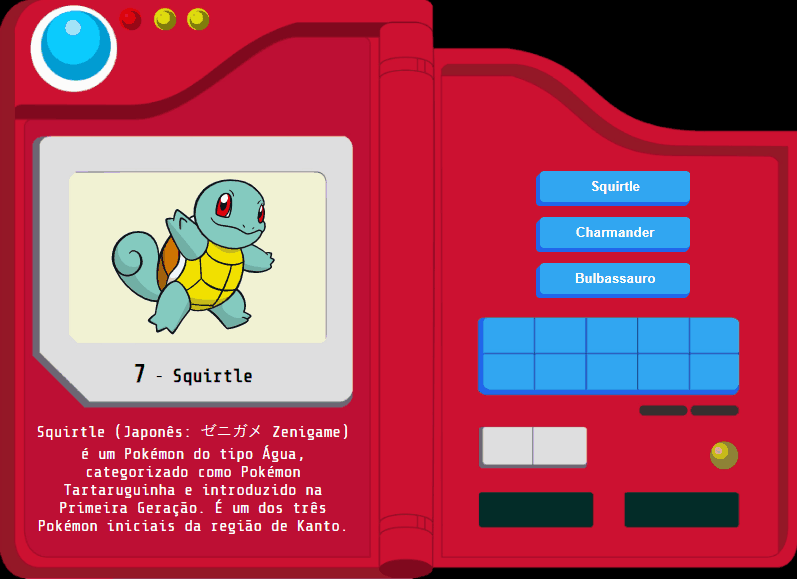

# PokéAgenda dos iniciais
## O exercício mais plurissemiótico encontrado no Github

Neste exercício você deverá preencher o código que falta para que a nossa Pokédex funcione com os pokémon iniciais.

O código do arquivo `parangaricotirimirroaro.js` já inclui o objeto necessário para isso, sendo necessário criar o JS que irá manipular o DOM no sentido de fazer os botões funcionarem.

## Como começar

Faça o *clone* deste repositório no seu computador em um diretório que ainda não seja um diretório git; depois você pode programar! O arquivo onde você deve incluir seu código é o `parangaricotirimirroaro.js`.

Este repositório é somente-leitura, ou seja você não vai conseguir dar `push` pra ele, **não havendo um avaliador** automático como nos projetos.

## Dicas:
- Procure utilizar um loop nos botões para evitar repetição de código
- Utilize os `data attributes` para evitar utilização de IFs
- Compartilhe o resultado no seu Linkedin

## O que eu aprendo com isso?

- Você irá sedimentar seu conhecimento sobre manipulação do DOM
- Você saberá como utilizar `data-attributes` para tornar o JS mais dinâmico
- Você verá como incluir **música** em seus projetos neste código-fonte
- No CSS você poderá ver como criar botões usando o Skeuomorphismo
- Descobrirá que programar é legalzão demais
